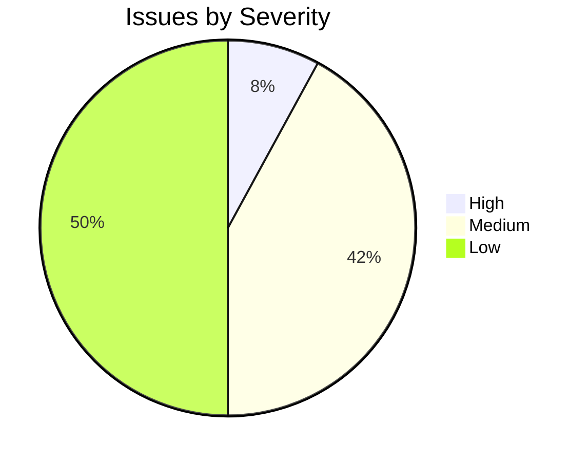
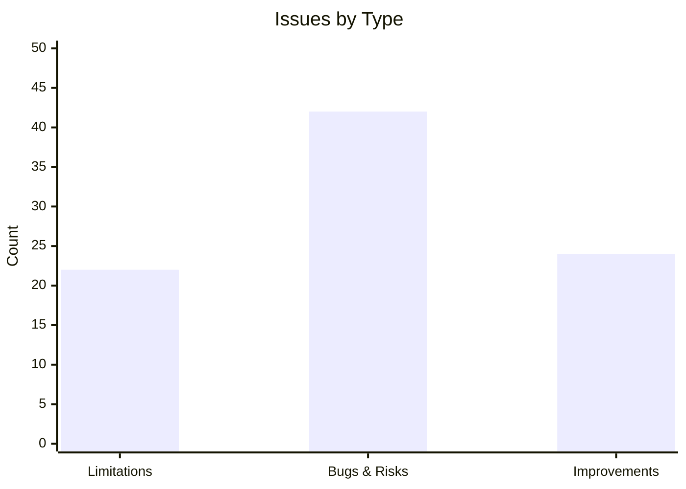
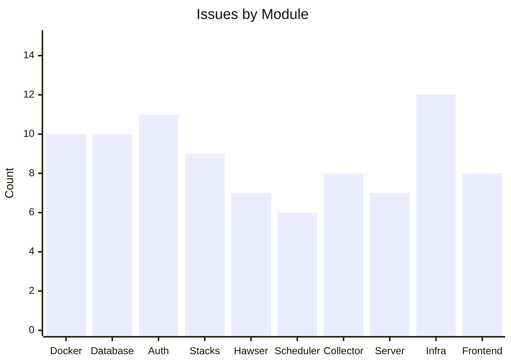

# Health Summary

Aggregated codebase health assessment for Dockhand, generated by automated issue analysis across all 10 modules.

## Severity Breakdown



**88 total issues** identified across 10 modules. 7 are high severity requiring attention.

## Issues by Type



## Issues by Module



## High-Severity Issues

| Issue | Module | Type | File |
|-------|--------|------|------|
| OIDC JWT signature not verified | [[Auth and Security]] | Bug/Risk | `auth.ts` |
| Encryption key rotation not atomic | [[Auth and Security]] | Bug/Risk | `encryption.ts` |
| No database transactions | [[Database]] | Limitation | `db.ts` |
| Encryption scattered across 40+ sites | [[Database]] | Bug/Risk | `db.ts` |
| No concurrent execution guard | [[Scheduler]] | Bug/Risk | `scheduler/tasks/` |
| Scanner lock race condition | [[Infrastructure Services]] | Bug/Risk | `scanner.ts` |
| Host-path silent failure on detection | [[Infrastructure Services]] | Bug/Risk | `host-path.ts` |

## Cross-Module Themes

**1. No transaction boundaries** — Multi-step mutations in [[Database]], [[Auth and Security]] (key rotation), and [[Scheduler]] (execution tracking) are not wrapped in transactions, risking inconsistent state on crash.

**2. In-memory state lost on restart** — Rate limiting, OIDC state, metrics, and Hawser connections all use `Map` instances that reset on process restart. This is acceptable for a single-instance deployment but limits scaling.

**3. Monolithic files** — `docker.ts` (5,264 lines), `db.ts` (4,681 lines), and `stacks.ts` (2,547 lines) are all single-file modules with no internal modularization.

**4. Authorization inconsistency** — Only ~18% of API endpoints check `canAccessEnvironment()` for enterprise RBAC scoping, creating a potential authorization gap.

**5. Fire-and-forget async operations** — Scheduler triggers, notification delivery, and credential migration are launched without `await`, risking unhandled rejections and ordering issues.

## Health Files

```dataview
TABLE title, type, status
FROM #code-docs AND #health
SORT title ASC
```

See [[Limitations]] for architectural constraints and [[Code Review]] for bugs, risks, and improvement opportunities.
